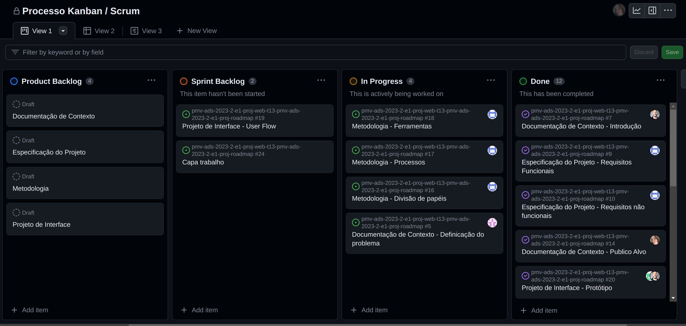
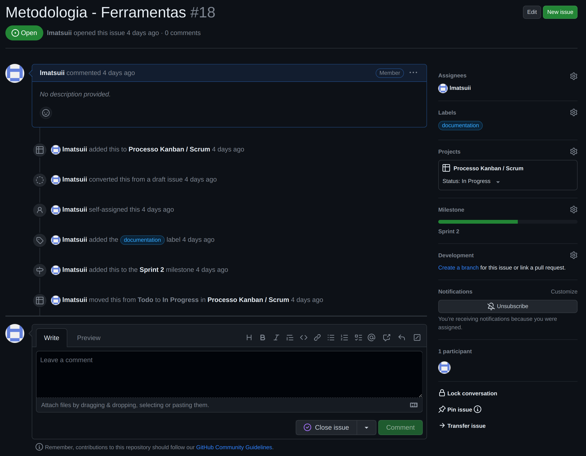
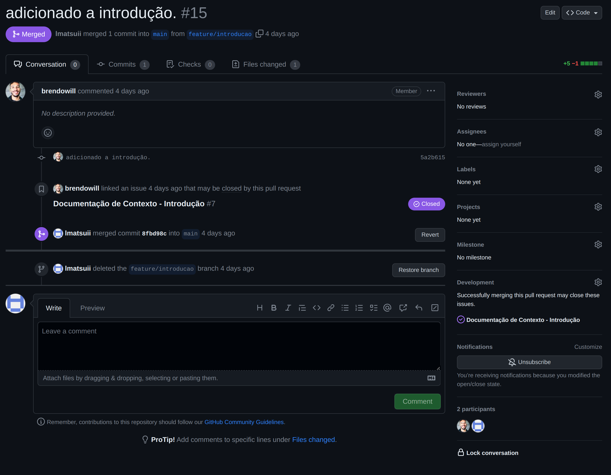

# Metodologia

Esta seção descreve a organização da equipe para a execução das tarefas do projeto e as ferramentas utilizadas para a manutenção dos códigos e demais artefatos.

## Gerenciamento de Projeto
A equipe optou por trabalhar com Processos Ágeis, adotando o Scrum como metodologia.

### Divisão de Papéis

Desta forma, a equipe está organizada da seguinte maneira:

`Scrum Master: Thais Bertini do Amaral`
`Product Owner: Leandro Hideki Matsui`

* Equipe de Desenvolvimento: 
  - Brendo William Rodrigues; 
  - Leonardo Hideki Matsui;
  - Raphael Diego de Oliveira L.;
  - Robert Luiz de S. Magnani;
  - Thais Bertini do Amaral.
* Equipe de Design: 
  - Brendo William Rodrigues; 
  - Raphael Diego de Oliveira L.
### Processo

#### Tarefas
Para organização e acompanhamento das tarefas, a equipe utiliza o Github Project.

O quadro de tarefas foi estruturado com os seguintes tópicos:

- Product Backlog: Contém os projetos que estão ou serão trabalhados
- Sprint Backlog: Esta lista representa as tarefas da Sprint atual que são geradas com base nos projetos do "Product Backlog"
- In Progress: Quando uma tarefa do "Sprint Backlog" é iniciada, ele é movido para cá.
- Done: Contém as tarefas que passaram pela revisão e foram aprovadas.

<figure> 
  
    <figcaption>Figura 1 - Board de tarefas do GithubProject</figcaption>
</figure> 

#### Artefatos
Para organização dos artefatos de documentações, códigos e assets, a equipe está utilizando o repositório do GitHub integrado ao GitHub Project.

A integração entre o "project" e "repositório" tem como objetivo agilizar os processos de acompanhamento e atualização das tarefas, funcionando da seguinte maneira:
1. Assim que a tarefa é aprovada para execução, é transformada em uma "Issue", ficando disponível no repositório (figura 2);
2. Quando o responsável pela tarefa finaliza, ele sobe os artefatos para um nova branch;
3. Com a nova branch disponível no repositório, é aberto o Pull Request vinculando a Issue que foi trabalhada (figura 3);
4. Assim que o pull request for revisado e aprovado, a Issue é fechada e a tarefa no Github Project é movida para done de forma automática

<figure> 
  
    <figcaption>Figura 2 - Github Issue</figcaption>
</figure> 

<figure> 
  
    <figcaption>Figura 4 - Github Pull Request</figcaption>
</figure> 

### Ferramentas

As ferramentas utilizadas pela equipe são:
- Editor de texto/código:
  - [VsCode](https://code.visualstudio.com/)
- Ferramenta para criação de Wireframe/Protótipo e User-flow
  - [Figma](https://www.figma.com/file/eIdsKBnbbFkEr7vQzYfppQ/Prototipo-Roadmap?type=design&node-id=0-1&mode=design)
- Ferramentas de comunicação
  - [Microsoft Teams](https://www.microsoft.com/pt-br/microsoft-teams/log-in)
  - [WhatsApp](https://www.whatsapp.com/?lang=pt_BR)
- Ferramenta de versionamento de código
  - [Github](https://github.com/ICEI-PUC-Minas-PMV-ADS/pmv-ads-2023-2-e1-proj-web-t13-pmv-ads-2023-2-e1-proj-roadmap)
- Ferramenta para gestão de tarefas
  - [Github Project](https://github.com/orgs/ICEI-PUC-Minas-PMV-ADS/projects/661/views/1)

### Estratégia de Organização de Codificação 

Todos os artefatos para funcionamento da aplicação deverão ser inseridos na pasta [codigo-fonte](https://github.com/ICEI-PUC-Minas-PMV-ADS/pmv-ads-2023-2-e1-proj-web-t13-pmv-ads-2023-2-e1-proj-roadmap/tree/main/codigo-fonte).