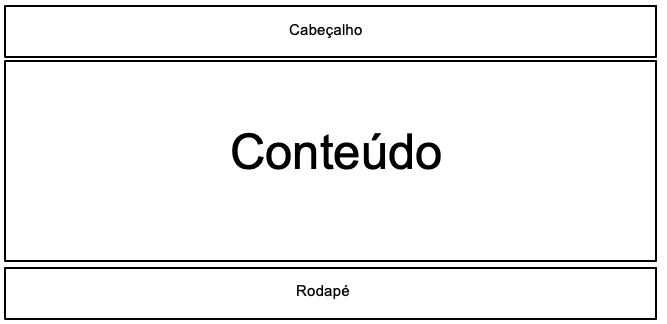

# Projeto de Interface

## User Flow

A figura 1 ilustra o fluxo de interação do usuário pelas telas do sistema. Cada tela deste fluxo é explicada na seção de Protótipo de baixa fidelidade que vem a seguir. Para visualizar o protótipo interativo, acesse https://www.figma.com/file/eIdsKBnbbFkEr7vQzYfppQ/Prototipo-Roadmap?type=design&node-id=0%3A1&mode=design&t=tD45koeObYR6m1qm-1

 
 figura 1

## Protótipo de baixa fidelidade

Protótipos de baixa fidelidade apresentam de forma simplificada o design da interface e o relacionamento entre suas páginas, permitindo evolução da proposta da solução. Neste projeto, os utilizaremos para apoiar a validação dos requisitos e efetuar mudanças dos mesmos, caso seja necessário, para menor impacto na codificação da aplicação.

O sistema possui uma estrutura comum nas suas telas, que é mostrada na figura 2. Nesta estrutura, há 3 grandes blocos, que são:

- Cabeçalho - onde se encontra o nome da aplicação web e a navegação principal do site (menu da aplicação);
- Conteúdo - onde se exibe o conteúdo da tela atual; 
- Rodapé - onde se informa os direitos autorais.

figura 2

### Tela - Home page 
A tela de home page apresenta um cabeçalho contendo botões para cadastro e login, informações em cards sobre o site e botões clicáveis para matérias de estudo.

figura 3

### Tela - Sobre nós 
A tela Sobre nós apresenta informações sobre o objetivo do site, o nome da equipe e o professor responsável.

figura 4

### Tela - Login/Cadastro 
A tela de Login/Cadastro apresenta campos para preenchimento com email e senha, dando a opção para realizar também um cadastro com campos para um formulário. O usuário pode escolher se quer se manter logado ou não.

figura 5

### Tela - Contato
A tela Contato apresenta um campo para envio de mensagem e campos para inserção de email e nome.

figura 6

### Tela - Suporte
A tela Suporte apresenta um campo para envio de mensagem e campos para inserção de email e nome.

figura 7

### Tela - Perfil 
A tela de Perfil apresenta na barra lateral a foto, o nome de perfil e as informações pessoais editáveis. Na parte central da página, há tópicos com o nível em porcentagem de desenvolvimento em cada matéria.

figura 8

### Tela - Conteúdos 
A tela de Conteúdos apresenta o roadmap da matéria selecionada, com conteúdos dispostos em ordem do iniciante ao avançado. Cada conteúdo é um tópico clicável que contém um resumo de estudo em texto e hiperlinks que direcionam para material de apoio.

figura 9

